---

  

  <em>General activity stats. These metrics include contributions to private repositories.</em>

---

  

  <em>My contribution activity over the past year, including private work.</em>

---

  

  <em>A breakdown of my coding patterns, typical activity times, and commit streaks.</em>

---

  

  <em>Language statistics based on code in both my public and private repositories.</em>

---

  

  <em>An estimate of lines of code contributed across projects.</em>

---

  <small>Metrics generated by <a href="https://github.com/lowlighter/metrics" target="_blank" rel="noopener noreferrer">lowlighter/metrics</a>. Last updated automatically.</small>

You might notice my GitHub contribution graph doesn't align with the activity shown above!
That's because the metrics above include my work in **private repositories**, which most, if not all
of my repositories are **private** and **closed-source.**
